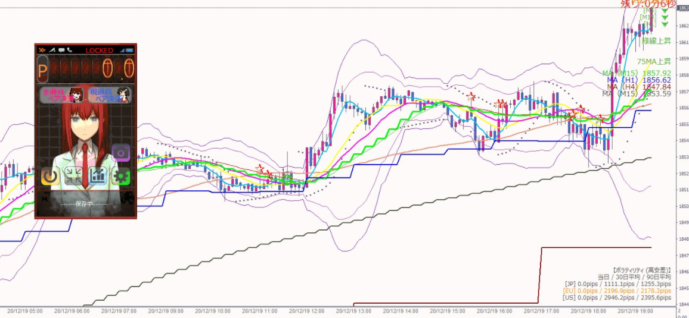

# Amadeus
牧瀬紅莉栖がFXをサポートしてくれるソフトです。  
確か製作期間は3か月ぐらいだった気がします。  
シュタゲ好きでＦＸやってる友達に作ってほしいと依頼されたのでノリで作りました。

## Image

## 機能
* チャートスクリーンショット
* 損益表示(Pips / Yen切り替え)
* 現通貨ペア決済
* 全通貨ペア決済
* 戦績表示
* 次のろうそく足出現までの時間表示
* 損益によって表情とかボイスとか変えたり

## 一言　
MQL5でのUI開発は本当にきつい。

